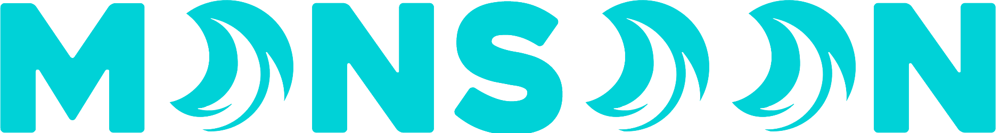

[](https://github.com/ahnaf-zamil/ws_rt_app/actions/workflows/server-ci.yml)


Monsoon is a secure, scalable, end-to-end encrypted messaging platform designed with a zero-trust architecture. It features client-side key generation and cryptographic operations to ensure that raw passwords and private keys never leave the user's device.

## Technology

- Backend: `Go, Gin, NATS, WebSocket, PostgreSQL`
- Frontend: `TypeScript, React, Web Crypto API`
- Cryptography: `TweetNaCl, Ed25519, X25519, AES-GCM, Argon2`

## Features

TODO: Write features

## Usage

### Client

Build CSS

```
yarn build:css
```

Run dev server

```
yarn dev
```

Build

```
yarn build
```

### Server


Make sure to change directory into [`server/`]("./server/") before running these commands.

Generate DB schema (will extend for migration later)

```
./run_migrations.sh
```

Regenerate Swagger docs

```
go install github.com/swaggo/swag/cmd/swag@latest
./generate_docs.sh
```

Generate mocks
```
go install github.com/golang/mock/mockgen@v1.6.0
./generate_mocks.sh
```

Start the API server
```
./start_server.sh
```

API Docs at `http://localhost:9000/swagger/index.html`

## To Do

- Set up separate DB for persisting messages
- Implement message encryption on client side (requirement: need to store key somehow, or pull key from DB upon page load using password)
- Room sync on client side upon connection
- Implement message bucketing and partitons
- Store key seed on client side (Possibly in SessionStorage with BroadcastChannel for inter-tab communication?)

## License

This project is licensed under the AGPL-3.0 License - see the [LICENSE](./LICENSE) file for details.
